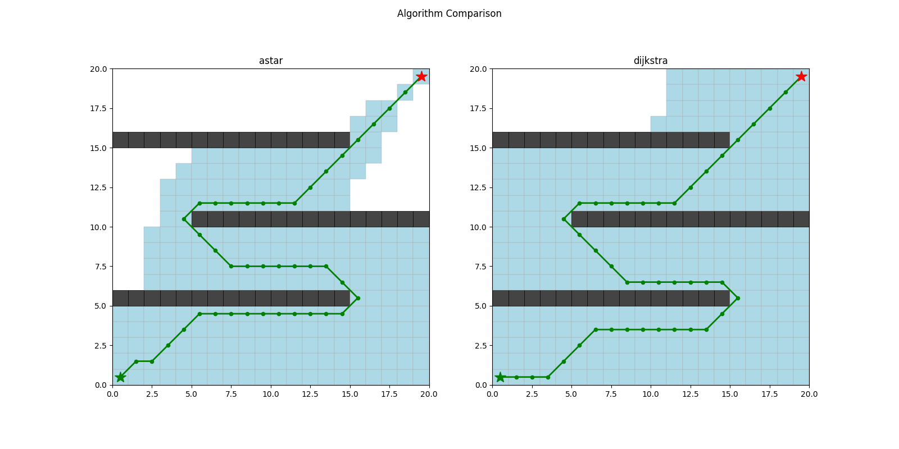
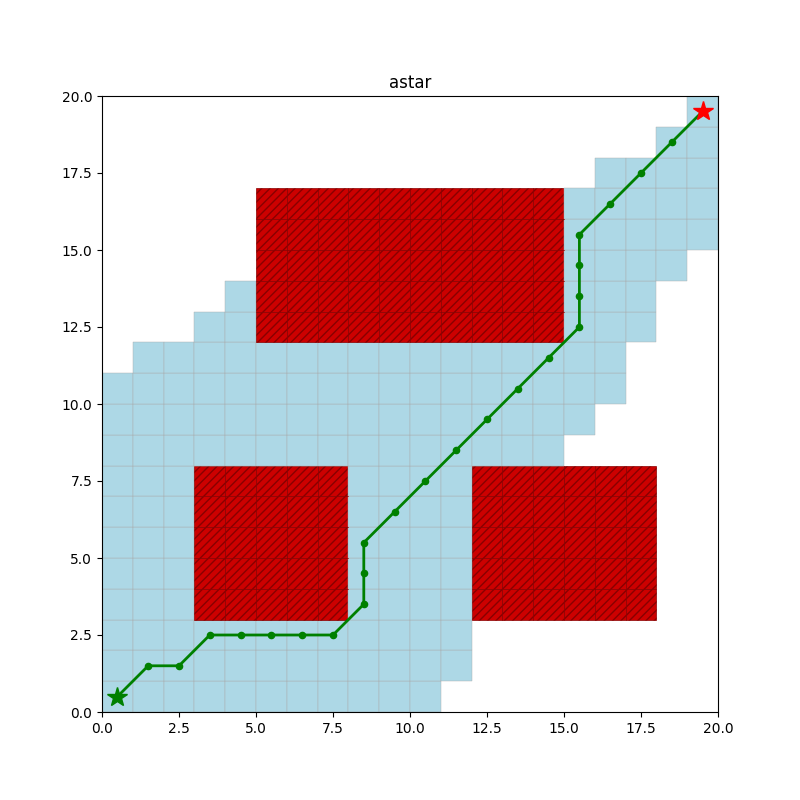
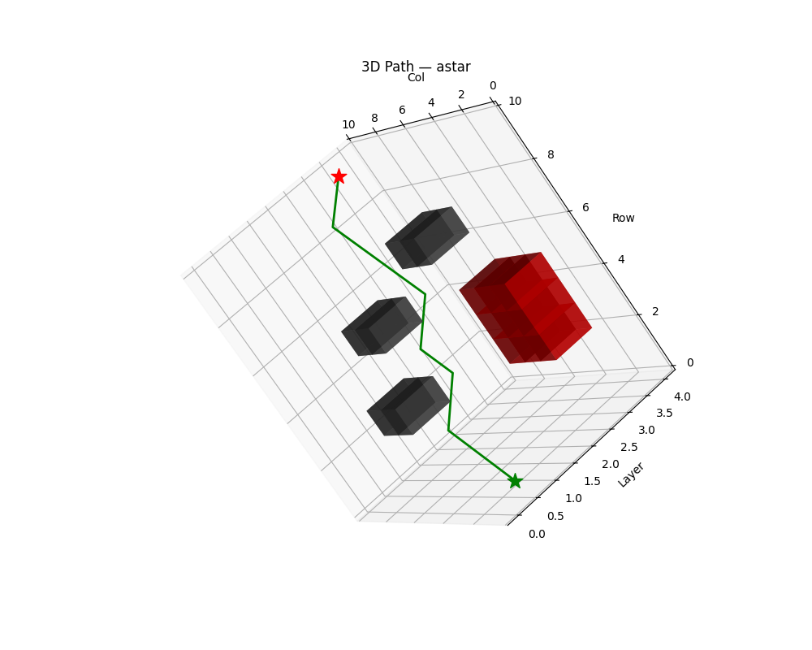

# drone-path-planner

Autonomous drone path planning simulation implementing A* and Dijkstra algorithms across configurable 2D and 3D grid environments with obstacle avoidance and matplotlib visualization.

## Features

- **A\* and Dijkstra** pathfinding on 2D and true 3D grids
- **Obstacles** (individual cells) and **No-Fly Zones** (rectangular regions, rendered red with crosshatch)
- **Configurable connectivity**: 8-connected (2D default) or 4-connected; 26-connected (3D default) or 6-connected
- **Side-by-side algorithm comparison** with Rich terminal stats table
- **Matplotlib visualization**: color-coded 2D grid and interactive 3D voxel plot
- **JSON export** for downstream analysis
- **4 built-in demo scenarios**: basic, maze, nfz-heavy, 3d-layers

## Installation

```bash
pip install -r requirements.txt
```

## Usage

### Single run (A* by default)

```bash
python -m drone_planner run --rows 20 --cols 20 --start "0,0" --goal "19,19"
```

### Add obstacles and no-fly zones

```bash
python -m drone_planner run \
  --rows 20 --cols 20 \
  --obstacle "5,5" --obstacle "6,5" --obstacle "7,5" \
  --nfz "10,3,14,8" \
  --algorithm astar
```

### Compare A* vs Dijkstra side-by-side

```bash
python -m drone_planner compare --rows 20 --cols 20 --nfz "5,3,10,12"
```

Example terminal output:

```
            Comparison
┌───────────┬───────┬─────────────┬────────────────┬───────────┐
│ Algorithm │ Found │ Path Length │ Nodes Explored │ Time (ms) │
├───────────┼───────┼─────────────┼────────────────┼───────────┤
│ astar     │ Yes   │      26.142 │             89 │    0.4821 │
│ dijkstra  │ Yes   │      26.142 │            285 │    0.8103 │
└───────────┴───────┴─────────────┴────────────────┴───────────┘
```

### 3D mode

```bash
python -m drone_planner run \
  --rows 10 --cols 10 --layers 4 \
  --start "0,0,0" --goal "9,9,3" \
  --obstacle "5,5,1" --nfz "3,3,6,6,2"
```

### Demo scenarios

```bash
python -m drone_planner demo --scenario basic
python -m drone_planner demo --scenario maze
python -m drone_planner demo --scenario nfz-heavy
python -m drone_planner demo --scenario 3d-layers
```

#### Maze — 20×20 grid with horizontal wall barriers



```
| Algorithm | Found | Path Length | Nodes Explored | Time (ms) |
|-----------|-------|-------------|----------------|-----------|
| astar     | Yes   |     48.8701 |            236 |    1.4727 |
| dijkstra  | Yes   |     48.8701 |            312 |    1.7036 |
```

#### NFZ-Heavy — 20×20 grid with three large no-fly zones



```
| Algorithm | Found | Path Length | Nodes Explored | Time (ms) |
|-----------|-------|-------------|----------------|-----------|
| astar     | Yes   |     29.7990 |            164 |    1.0787 |
```

#### 3D Layers — 10×10×4 grid, multi-layer navigation



```
| Algorithm | Found | Path Length | Nodes Explored | Time (ms) |
|-----------|-------|-------------|----------------|-----------|
| astar     | Yes   |     13.6814 |            161 |    5.0149 |
| dijkstra  | Yes   |     13.6814 |            385 |    9.7909 |
```

### Export results to JSON

```bash
python -m drone_planner compare --export results.json --no-viz
```

Example `results.json`:

```json
{
  "grid": { "rows": 20, "cols": 20, "layers": 1 },
  "algorithms": [
    {
      "name": "astar",
      "path": [[0, 0], [1, 1], "..."],
      "path_length": 26.1421,
      "nodes_explored": 89,
      "compute_time_ms": 0.4821,
      "found": true
    }
  ]
}
```

## CLI Reference

### `run`

| Flag | Default | Description |
|---|---|---|
| `--rows` | 20 | Grid rows |
| `--cols` | 20 | Grid cols |
| `--layers` | 1 | Altitude layers (>1 enables 3D) |
| `--start` | `"0,0"` | Start cell |
| `--goal` | last cell | Goal cell |
| `--obstacle` | — | Obstacle cell (repeatable) |
| `--nfz` | — | NFZ rectangle `"r1,c1,r2,c2"` (repeatable) |
| `--algorithm` | `astar` | `astar` or `dijkstra` |
| `--heuristic` | chebyshev/euclidean | `manhattan`, `chebyshev`, or `euclidean` |
| `--connectivity` | 8 (2D) / 26 (3D) | `4`/`8` (2D) or `6`/`26` (3D) |
| `--export` | — | Write JSON to file |
| `--no-viz` | false | Skip matplotlib display |

### `compare`

Same flags as `run` except `--algorithm` and `--heuristic`; always runs both algorithms.

### `demo`

| Flag | Default | Description |
|---|---|---|
| `--scenario` | `basic` | `basic`, `maze`, `nfz-heavy`, `3d-layers` |
| `--no-viz` | false | Skip matplotlib display |
| `--export` | — | Write JSON to file |

## Visualization

**2D grid** — white = empty, dark gray = obstacle, red crosshatch = no-fly zone, light blue = explored nodes, green line = path.

**3D plot** — interactive voxel rendering; drag to rotate. Obstacles/NFZs appear as colored blocks at their altitude layers.

## Running Tests

```bash
python -m pytest tests/ -v
```

81 tests covering grid construction, pathfinding correctness, JSON export, visualizer figure creation, and CLI commands.

## Architecture

```
drone_planner/
├── grid.py        # Grid, Grid3D, CellState
├── algorithms.py  # astar(), dijkstra(), PathResult
├── visualizer.py  # plot_2d(), plot_compare(), plot_3d()
├── exporter.py    # export_json()
└── cli.py         # Typer app: run, compare, demo
```
